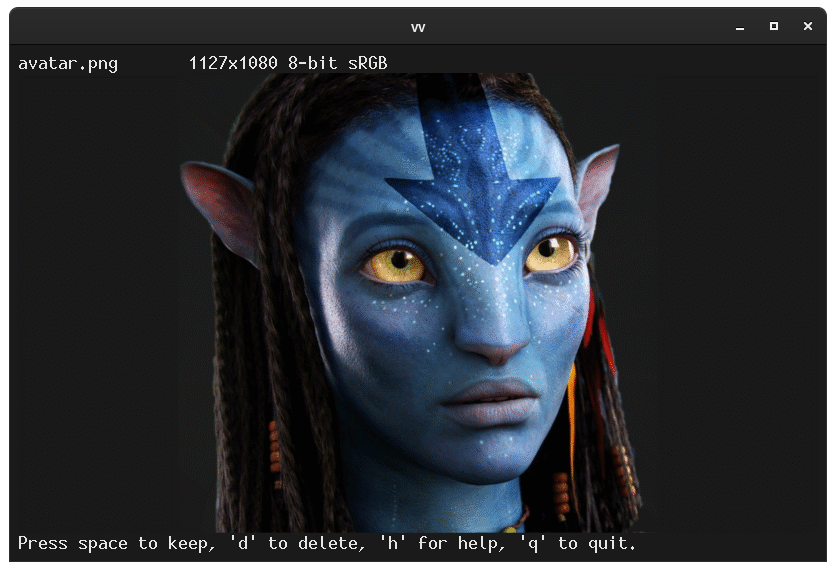

# vv

A simple image viewer for terminals capable of sixel graphics.

Quickly preview, delete, and move files. Particularly useful on remote
machines over `ssh`.

## Installation

It's just a shell script. Just download
[vv](https://github.com/hackerb9/vv/blob/main/vv) to a directory in
your PATH (e.g., $HOME/bin or /usr/local/bin) and make it executable
(chmod +x vv). 

## Required dependencies

* A sixel capable terminal (e.g., xterm -ti vt340).
* ImageMagick

### Recommended but not required

* ncurses-bin (for tput)
* file (determine filetype by magic numbers rather than extension)
* mediainfo (quickly count number of frames in a video)
* GNU coreutils (for realpath, for deleting images to trashcan)
* curl, w3m and w3m-img for text based reverse image search
* Bash version >=5 (read bug workaround)
* [sixvid](https://github.com/hackerb9/sixvid) & ffmpeg: so viewing a
  gif or mp4 will play an animation
* poppler-utils (for pdfinfo to count pages in PDF files)

## Some nice features
* Can display any image type. (Via ImageMagick).
* Detects images by magic, not by extension.
* Shows everything in the current working directory by default.
* Loads directories recursively (default: ask;  -r: always;  -R: never).
* Scales down large images to fit within terminal.
* Supports "fit width" (`w`) mode; portrait pictures scroll vertically.
* Can view at "100% zoom" (`1`). Cuts large picture into pieces, if necessary.
* Has "best fit" (`B`), autorotate to use as much of the screen as possible.
* Defaults to fast viewing [-F] to quickly preview and delete (`d`) images,
  or use [-f] to default to full-size (slower, highquality) view.
* Hit (`v`) to view full-size (slower, highquality) for current image only,
  or use (`f`) to toggle between fast and full-size viewing mode.
* Preview size can be increased (`+`), decreased (`-`), or reset (`0`).
* Deleted (`d`) images are moved to Trashcan (Freedesktop standard).
* Can undo (`u`) last trashed file.
* Move (`m`) and save-a-copy (`s`) remember previously used directory.
* Web reverse image search (`W`). (Currently uses yandex).
* Slideshow mode (`S`).
* Renaming a file (`r`) uses readline for easier editing.
* Edit embedded comments (`C`). Works with JPEG, PNG, TIFF, GIF, and more.
* Embedded comments can have multiple lines (use ^V^J for a new line).
* Sets xterm to use more color registers for higher quality pictures.
* Work on true DEC hardware (e.g., VT340).
* Resizes current image when terminal resizes. (SIGWINCH).
* Pixel height of preview is a multiple of the current text font height,
  so previews should be the right size no matter your screen resolution. 
* Pixel width of preview is always the full width of the terminal.
* View videos (`v`) such as animated GIFs. (Requires 'sixvid' and ffmpeg).
* Icons and small images can be zoomed in to screen size. (`z` to toggle).
* Breadth first search. Images in current dir are shown before subdirs.
* If renaming or moving would overwrite an image with a different one,
  both images are shown side-by-side. 
* Images with transparency use the terminal's background color.

## NOTES

### Note 1

This is designed mainly for quickly previewing, deleting, and renaming
images over an ssh connection. For that reason, fast, small,
low-quality images are emphasized and deletion is a single keystroke.
(Note, undeletion is also a single key).

### Note 2

libglib2.0-bin's 'gio' will used for moving files to the Trashcan, if
it is installed, but it is not required. See the trash() and untrash()
shell functions.

### Note 3

Bash 4.4 had a bug where catching SIGWINCH in the middle of a normal
'read' would cause the stty to go insane. For that reason, in the main
loop we use 'read -e' which uses readline and does not suffer from the
bug. (Bash 5 is fine.)

### Note 4

ImageMagick 6.9 may not support webm video.

### Note 5

ImageMagick 6.9.10 has a bug where a filename that has a colon in it
will not work when frame zero is selected. As a workaround, this
script uses "file://$filename[0]".

## Todo

* We're sending OSC 8 hyperlinks, but do they work?
* Add --cat option which just splats images out as fast as possible.
* Handle genuine VT340 specially so it doesn't change foreground/background colors. 
* Reconsider `v` (view just this image fullscreen) and `f` (fullscreen
  toggle) keys. Maybe should either be modal or not. May help to
  redefine `Enter` to always switch to fast mode and 'f' to always switch
  to fullscreen mode? 
* Allow file sortorder to be changed interactively instead of editing
  script. (modification/access time, natural sort).
* Should not show pdf, odt, xls and other slow formats by default.
* Currently prompt is less verbose if the screen width is too short, but maybe that should always be the case and only show the succinct help only if a wrong key is hit.
* Implement "-1" and "-w" to default to 1-for-1 and Wide view mode.
* Consider using b9's feh key bindings.
* Show a quick overview of all images in the directory. (Like lsix).
* Allow selecting a range of images for deletion.
* imageinfo() calls ImageMagick's identify which is too slow.
* Use exiftool for property adjustments, not imagemagick which fails.
* Use an array of filenames so user can go back to previous, and
  so untrash won't take place of current image.
* Use vi/nethack keys. (`j` next, `k` prev, `h` back to parent directory, `l` ?) 
* Include mycompare.sh to interactively compare two files.
  (Side-by-side or A/B)
* Edit Caption, Title, Headline in IPTC, XMP
* Allow user to force white/black background. (Mainly for text pdfs).
  Alternately, perhaps a key to disable alpha channel would be better.
* Add a key for opening image in standard graphical viewer.
  (Maybe dial `M` for mime? `O` for open?)
* Perhaps also allow graphical browser during reverse image search.
* Maybe use multiprocessing by converting full screen images in patches.
  (Added benefit, extends Xterm's default 1000x1000 limitation).
* Maybe quit immediately (batch mode) if only 1 image on command line.
  This would obviate the need for b9's `sixcat` program.
* PDF documents should work like a directory, asking user if they want
  to open and show images inside.
* CBZ, comicbook zip files should also work like directories.
* Should handle when ImageMagick dies due restrictions in
  /etc/ImageMagick-6/policy.xml. (For example, viewing an xcf file
  will often overrun the memory limit).

## Questions

* Should we allow SVG and EPS which are images, but can execute code?
* Entering multiline comments are weird because you have to type `^V`
  `^J` to create a newline. Should they pop open an editor?

## About Metadata

The author, hackerb9, has long added little notes and blurbs to
images in the JPEG "Comments" field. However, that humble field has
been extended by EXIF, IPTC, and XMP to a dizzying degree:
Description, Caption, Headline, Title, .... If you are a
professional photographer and have feedback on how this program can
better show and manipulate metadata, please send a bug report at
https://github.com/hackerb9/vv/issues/

### Here's what we know. 

The IPTC industry standards define Title, Description/Caption, and Headline as:

#### "Title", AKA "Document Title", AKA "Object Name"

A shorthand reference for the image or “photograph” - primarily for
identification. The title of an image should be a short,
human-readable name - text and/or numeric reference - and may take
several forms. For photographers, this might be the filename of their
original scan or digital camera file. The Title term should not be
confused with the Headline term, which is a short synopsis of the
photograph's content.

Title Examples: _"IMG\_9873"_, or  _"Sunrise Over Temple"_

#### "Description", AKA "Caption"

The Description field, often referred to as “Caption,” should report
the who, what and why of what the photograph depicts. If there is a
person or people in the image, this caption might include their names,
and/or their roles in any action taking place. If the image depicts a
location, then it should describe the location.

Description Example: _"The Shore Temple of the Seven Pagodas was built
under Narsimha II of the Pallava dynasty between 7th and 8th century
AD and is dedicated to Lord Shiva. It resembles the structure of the
Dharmaraja rath, but its tower rises much higher (approx. five stories
or ~ 60 ft. high) and its stupa spire is small and slender."_

#### Headline

A headline is a brief, publishable synopsis or summary of the contents
of the photograph. Like a news story's lead, the Headline should grab
attention and summarize the image's content. Headlines must be
succinct. Leave any supporting narrative for the Description field. Do
not, however, confuse the Headline term with Title.

Headline Example: _"Shore Temple, Malibalipuram, India"_

### IPTC Summary

So, it sounds like, in theory, "Title" is supposed to be the title of
the document, like a filename and would be where we jot down typical
comments. HOWEVER: Microsoft Windows uses "Title" as the Caption and
Flickr uses "Title" as the Headline. So, YMMV.

For now, vv does not alter IPTC and only allows setting the "Comment"
field using the `C` key`. However, the editproperty function should
work once we figure out what the right field to edit is.

